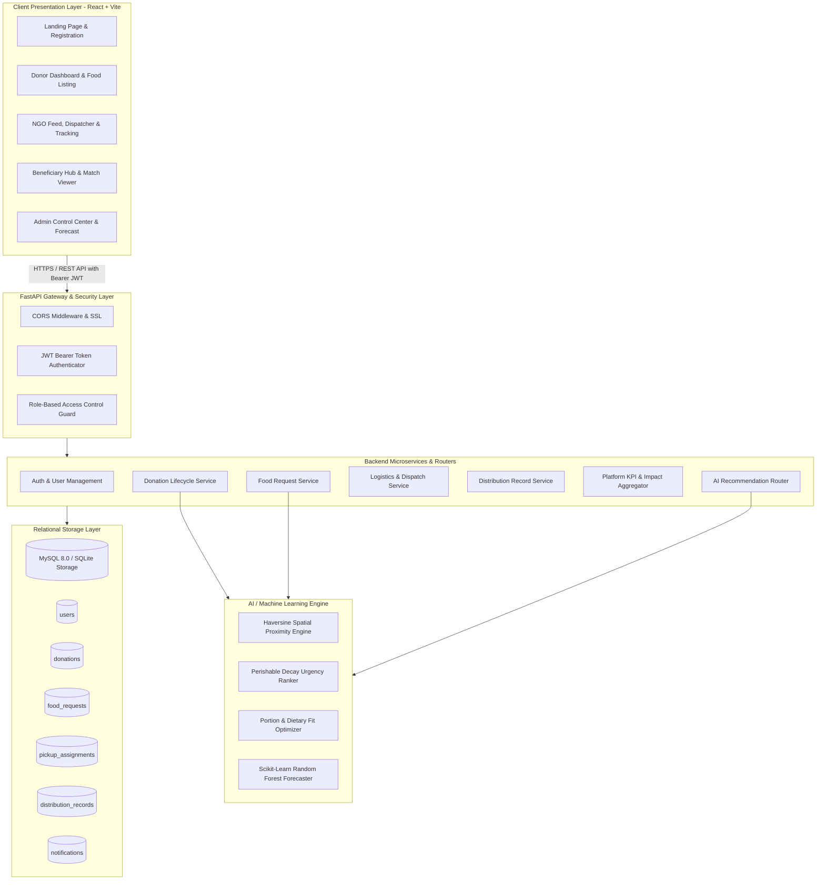
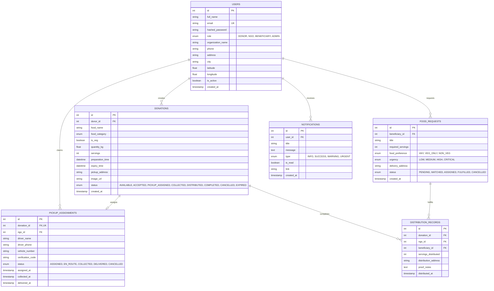

# System Architecture - Smart Food Distribution Platform

## 1. Executive Summary
The **Smart Food Distribution Platform** is a full-stack, AI-powered humanitarian logistics platform engineered to reduce commercial food waste and eradicate hunger. It connects four distinct ecosystem roles:
1. **Food Donors**: Commercial kitchens, hotels, banquet halls, supermarkets, and individuals.
2. **NGOs & Volunteers**: Relief teams and field volunteers who collect and distribute food.
3. **Beneficiaries**: Homeless shelters, community orphanages, eldercare centers, and families.
4. **Platform Administrators**: Super-users managing verification, analytics, and audit logging.

---

## 2. High-Level Architecture Diagram

---

## 3. Database Entity-Relationship (ER) Model

---

## 4. Role-Based Access Control (RBAC) Matrix

| Resource / Action | Food Donor | NGO / Volunteer | Beneficiary | Admin |
| :--- | :---: | :---: | :---: | :---: |
| **Post Surplus Food** | ✅ | ❌ | ❌ | ✅ |
| **Edit / Cancel Own Listing** | ✅ | ❌ | ❌ | ✅ |
| **Browse Surplus Marketplace** | ❌ | ✅ | ❌ | ✅ |
| **Claim & Assign Driver** | ❌ | ✅ | ❌ | ✅ |
| **Update Logistics Status** | ❌ | ✅ | ❌ | ✅ |
| **Submit Meal Request** | ❌ | ❌ | ✅ | ✅ |
| **View AI Matched Food** | ❌ | ✅ | ✅ | ✅ |
| **Record Distribution Proof** | ❌ | ✅ | ❌ | ✅ |
| **Platform User Governance** | ❌ | ❌ | ❌ | ✅ |
| **AI Demand Forecast Model** | ❌ | ✅ | ❌ | ✅ |

---

## 5. AI / ML Smart Matching Model Formulation

The matching engine uses multi-criteria decision analysis (MCDA) combining spatial distance, perishable urgency decay, capacity fit, and dietary preferences:

$$
\text{Match Score} = w_1 \cdot \mathcal{S}_{\text{dist}} + w_2 \cdot \mathcal{S}_{\text{urgency}} + w_3 \cdot \mathcal{S}_{\text{portion}} + w_4 \cdot \mathcal{S}_{\text{diet}}
$$

Where weights are configured as:
- $w_1 = 0.35$ (Distance Proximity via Haversine)
- $w_2 = 0.30$ (Perishable Expiry Decay)
- $w_3 = 0.20$ (Portion Capacity Fit)
- $w_4 = 0.15$ (Dietary Preference Compliance)

### Haversine Formula for Distance
$$
d = 2R \arcsin \left( \sqrt{\sin^2\left(\frac{\Delta \phi}{2}\right) + \cos(\phi_1)\cos(\phi_2)\sin^2\left(\frac{\Delta \lambda}{2}\right)} \right)
$$
Where $R = 6371 \text{ km}$. Distance is normalized over a 20 km urban delivery radius.
